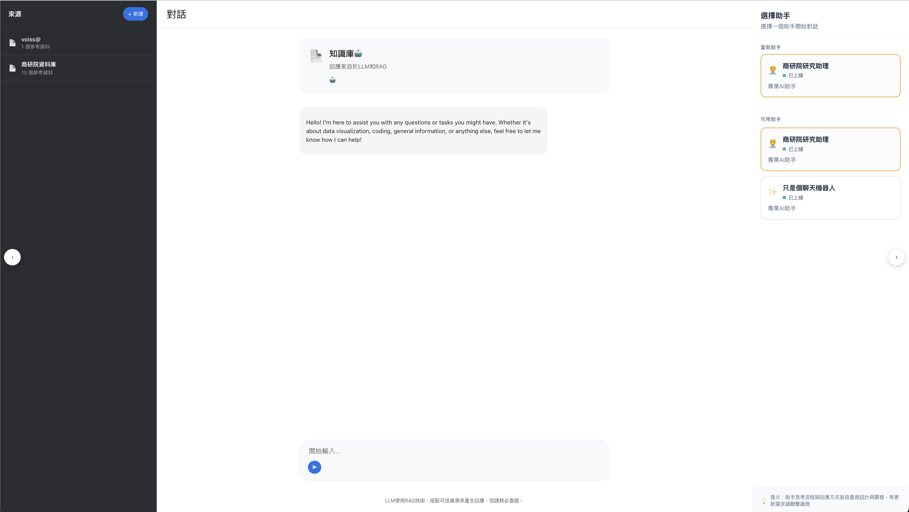

# React Chatbot UI

A modern, responsive chatbot interface built with React and TypeScript. This application provides an intuitive chat experience with agent selection, knowledge base integration, and source document management.



## Features

- **Multi-Agent Support**: Select and switch between different AI agents
- **Knowledge Base Integration**: Upload and manage knowledge base documents
- **Source Panel**: View and manage source documents and references
- **Real-time Chat**: Interactive chat interface with message formatting
- **Settings Management**: Configure API endpoints and application settings
- **Responsive Design**: Modern UI that works across desktop and mobile devices
- **Docker Support**: Easy deployment with Docker and Docker Compose

## Tech Stack

- **Frontend**: React 19.1.0 with TypeScript
- **Routing**: React Router DOM
- **Styling**: CSS with custom animations
- **Markdown**: markdown-it for rich text rendering
- **Testing**: Jest and React Testing Library
- **Containerization**: Docker

## Quick Start

### Prerequisites

- Node.js 16+ 
- npm or yarn
- Docker (optional)

### Installation

1. Clone the repository:
```bash
git clone <repository-url>
cd react-chatbot-ui
```

2. Install dependencies:
```bash
npm install
```

3. Start the development server:
```bash
npm start
```

4. Open [http://localhost:3000](http://localhost:3000) to view the application.

### Docker Deployment

1. Build and run with Docker Compose:
```bash
docker-compose up --build
```

2. Or build manually:
```bash
docker build -t react-chatbot-ui .
docker run -p 3000:3000 react-chatbot-ui
```

## Usage

1. **Agent Selection**: Choose your preferred AI agent from the agent selector
2. **Knowledge Base**: Upload documents to enhance the chatbot's knowledge
3. **Chat Interface**: Start chatting with the selected agent
4. **Source Management**: View and manage reference documents in the source panel
5. **Settings**: Configure API endpoints and application preferences

## Development

### Available Scripts

- `npm start` - Runs the app in development mode
- `npm test` - Launches the test runner
- `npm run build` - Builds the app for production
- `npm run eject` - Ejects from Create React App (one-way operation)

### Project Structure

```
src/
├── components/          # Reusable UI components
│   ├── AgentSelector.tsx
│   ├── ChatPanel.tsx
│   ├── KnowledgeBaseUpload.tsx
│   ├── Settings.tsx
│   └── SourcePanel.tsx
├── hooks/              # Custom React hooks
├── pages/              # Page components
├── styles/             # CSS and animations
└── App.tsx            # Main application component
```

## Contributing

1. Fork the repository
2. Create your feature branch (`git checkout -b feature/amazing-feature`)
3. Commit your changes (`git commit -m 'Add some amazing feature'`)
4. Push to the branch (`git push origin feature/amazing-feature`)
5. Open a Pull Request

## License

This project is licensed under the MIT License.
